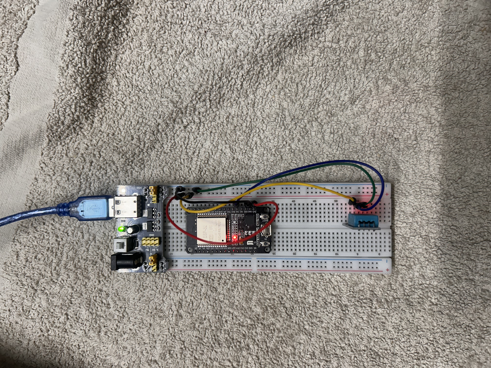
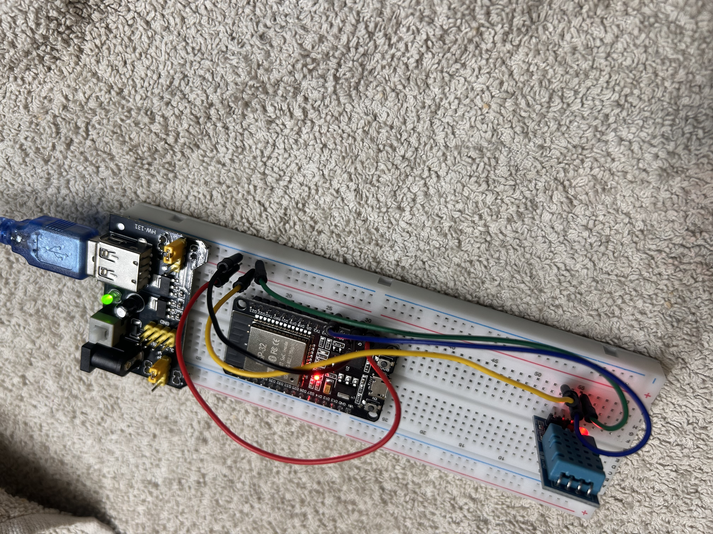
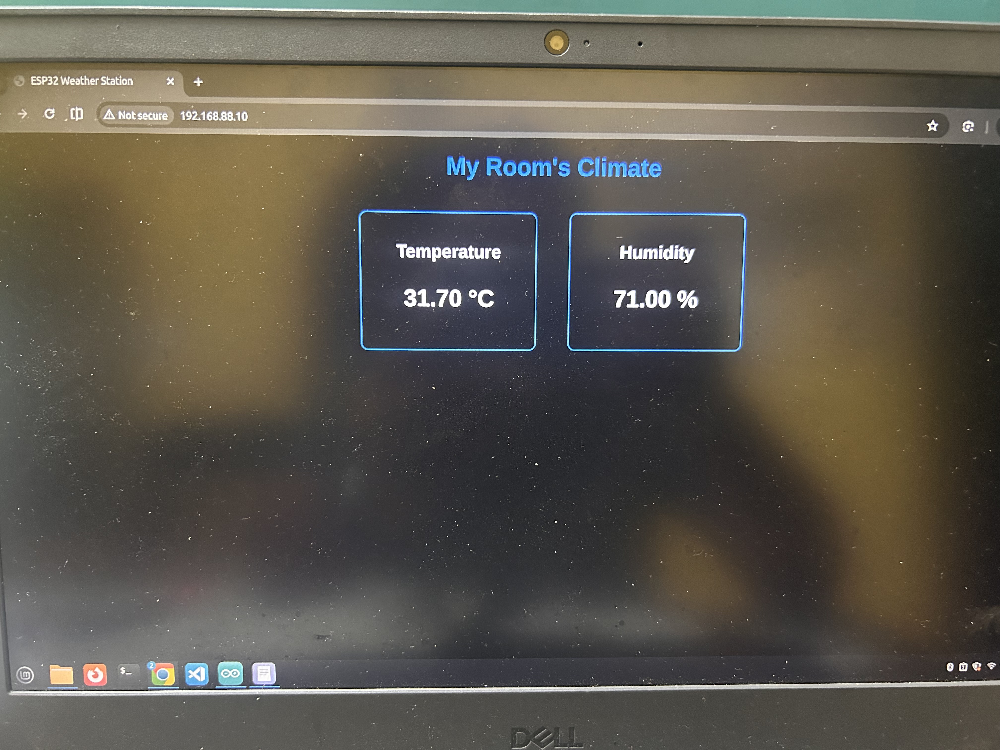

# 🌍 ESP32 IoT Smart Weather Station

An internet-connected environmental monitor that reads real-time temperature and humidity from a room and serves it on a custom-styled, dark-mode webpage hosted locally by the microcontroller.

## 📸 The Completed Setup

Here is the fully assembled breadboard setup alongside the live network dashboard:

### Physical Assembly

### Live Weather Dashboard

## 🛠️ Components List

This project utilized the following hardware components:
* **Microcontroller:** ESP32 Development Board (30-pin, CP2102 variant)
* **Sensor:** DHT11 Temperature and Humidity Sensor Module
* **Power Supply:** MB-102 Breadboard Power Supply Module (delivering regulated 3.3V)
* **Prototyping:** Half-Size Breadboard (400 points), Jumper Wires (M-M and M-F), Jumper Caps
* **Connections:** Micro-USB Data Cable, USB-A Male to Male Power Cable (for power module only)

## 💻 Technical Progress and Milestones

1.  **System Preparation:** Installed and configured the **Linux Mint (Cinnamon)** development environment and Arduino IDE.
2.  **Driver Resolution:** Verified kernel integration of the SILABS CP2102 USB-to-UART Bridge (solving a critical 'No Port Detected' issue with `lsusb`).
3.  **Hardware Optimization:** Configured the MB-102 power module (adjusting yellow jumper caps for 3.3V) to ensure stable power delivery, separating it from the data connection.
4.  **Local Sensor Reading:** Successfully validated DHT11 readings in the Serial Monitor (printing live Celsius and % data).
5.  **IoT Web Server Deployment:** Wrote a multi-threaded ESP32 sketch using `WiFi.h` and the Adafruit DHT library to create a basic, CSS-styled HTML webpage hosted at `http://192.168.x.x` on the local network.

## 🚀 How to Run this Project

1.  Open the included `.ino` sketch in Arduino IDE.
2.  Install the 'DHT sensor library' (Adafruit) via the Library Manager.
3.  ⚠️ **Modify the code:** Locate the lines for `ssid` and `password` and update them with your home Wi-Fi credentials.
4.  Connect your ESP32 directly to your computer using a *micro-USB data cable*.
5.  Select **'ESP32 Dev Module'** and your port, and click **Upload**.
6.  Open the Serial Monitor (115200 baud) to find the assigned IP address.
7.  Ensure your browser and ESP32 are on the same network band (2.4 GHz). Navigate to that IP address to see the live data page!

***

*Progress successfully tracked and documented via GitHub Web and GitHub Mobile interface.*
